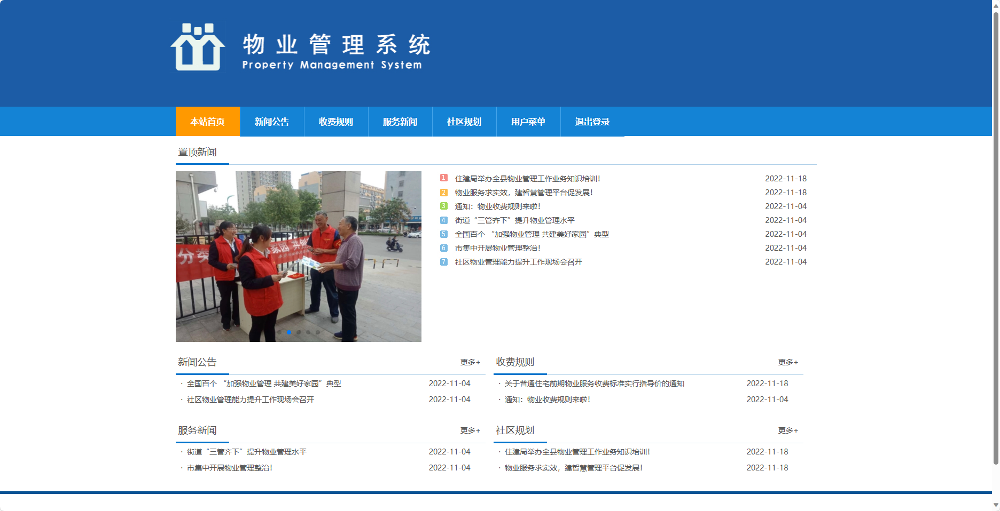
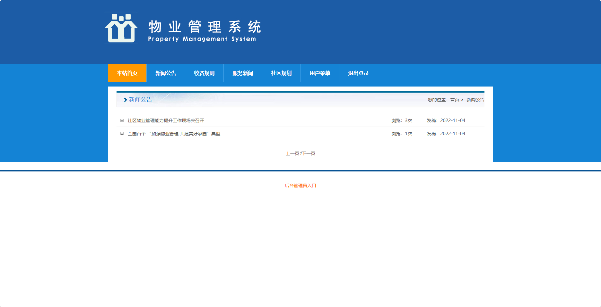
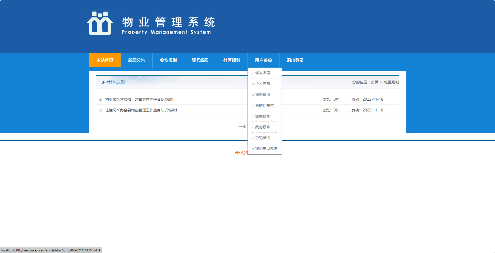
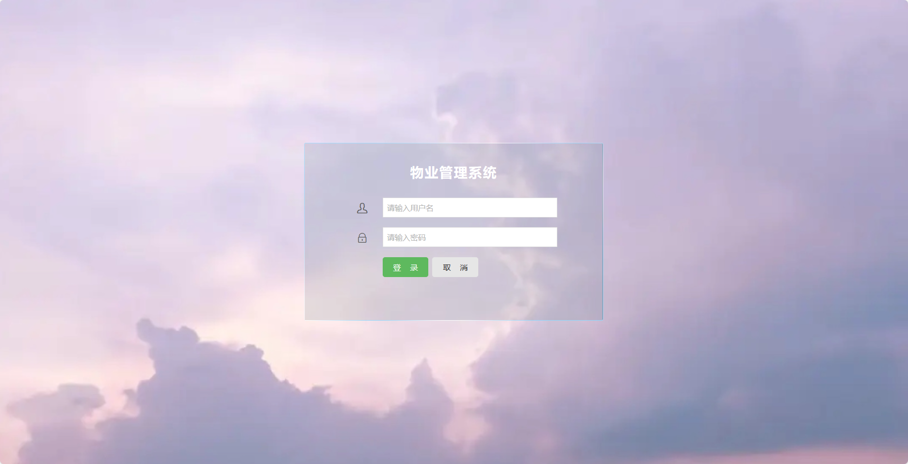
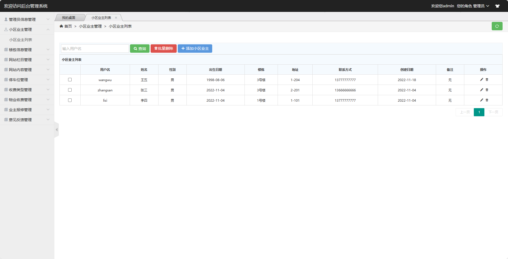
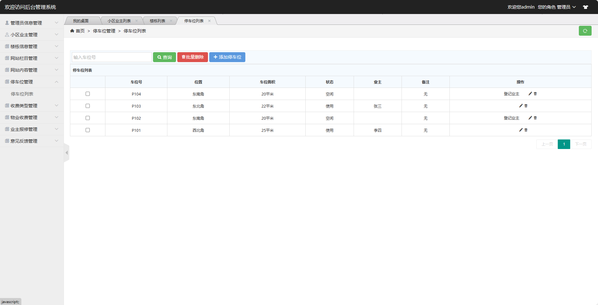

基于Springboot的物业管理系统
=
### 完整代码获取地址：从戎源码网 ([https://armycodes.com/](https://armycodes.com/))
### 作者微信：19941326836  QQ：952045282 
### 承接计算机毕业设计、Java毕业设计、Python毕业设计、深度学习、机器学习
### 选题+开题报告+任务书+程序定制+安装调试+论文+答辩ppt 一条龙服务
### 所有选题地址https://github.com/nature924/allProject

一、项目介绍
---
基于Springboot框架实现的物业管理系统包含两种角色：管理员、用户,系统分为前台和后台两大模块，主要功能如下。

### 【前台】：
1. 本站首页：显示物业管理系统的相关信息和功能导航。
2. 新闻公告：用户可以查看物业相关的新闻和公告信息。
3. 收费规则：用户可以查看物业的收费规则和费用标准。
4. 服务新闻：用户可以查看物业提供的各项服务的相关信息。
5. 社区规划：用户可以查看物业社区的规划图和相关信息。
6. 用户登录：用户可以通过用户名和密码进行登录。

### 【用户】
1. 修改密码：用户可以修改自己的登录密码。
2. 个人信息：用户可以查看和编辑自己的个人信息，包括姓名、联系方式等。
3. 我的费用：用户可以查看自己的物业费用情况，包括已缴费用和未缴费用。
4. 我的停车位：用户可以查看自己的停车位信息，包括停车位号、所属楼栋等。
5. 业主报修：用户可以提交报修请求，包括选择报修类型、填写报修描述等。
6. 我的报修：用户可以查看自己提交的报修请求的处理情况，包括维修人员指派、维修进度等。
7. 意见反馈：用户可以提交意见反馈，包括填写反馈内容和联系方式。
8. 我的意见反馈：用户可以查看自己提交的意见反馈的处理情况，包括管理员的回复等。

### 【后台】：
1. 管理员信息管理：管理员可以管理系统的管理员账号和权限，包括添加、编辑、删除管理员，设置管理员权限等。
2. 小区业主管理：管理员可以管理小区业主的信息，包括添加、编辑、删除业主，修改业主信息等。
3. 楼栋信息管理：管理员可以管理小区楼栋的信息，包括添加、编辑、删除楼栋，修改楼栋信息等。
4. 网站栏目管理：管理员可以管理网站的栏目，包括添加、编辑、删除栏目，调整栏目顺序等。
5. 网站内容管理：管理员可以管理网站的内容，包括添加、编辑、删除内容，发布新闻和公告等。
6. 停车位管理：管理员可以管理小区的停车位，包括添加、编辑、删除停车位，管理停车位信息等。
7. 收费类型管理：管理员可以管理物业的收费类型，包括添加、编辑、删除收费类型，设置收费标准等。
8. 物业收费管理：管理员可以管理物业的收费情况，包括记录和管理业主的缴费情况，生成收费通知等。
9. 业主报修管理：管理员可以管理业主的报修情况，包括记录和处理报修请求，指派维修人员等。
10. 意见反馈管理：管理员可以管理用户的意见反馈，包括查看和回复用户的反馈信息。

二、项目技术
---
- 编程语言：Java
- 数据库：MySQL
- 项目管理工具：Maven
- 前端技术：VUE、HTML、Jquery、Bootstrap
- 后端技术：Spring、SpringMVC、MyBatis

三、运行环境
---
- 操作系统：Windows、macOS都可以
- JDK版本：JDK1.8以上都可以
- 开发工具：IDEA、Ecplise、Myecplise都可以
- 数据库: MySQL5.7以上都可以
- Tomcat：任意版本都可以
- Maven：任意版本都可以

四、运行截图
---
### 程序截图：

